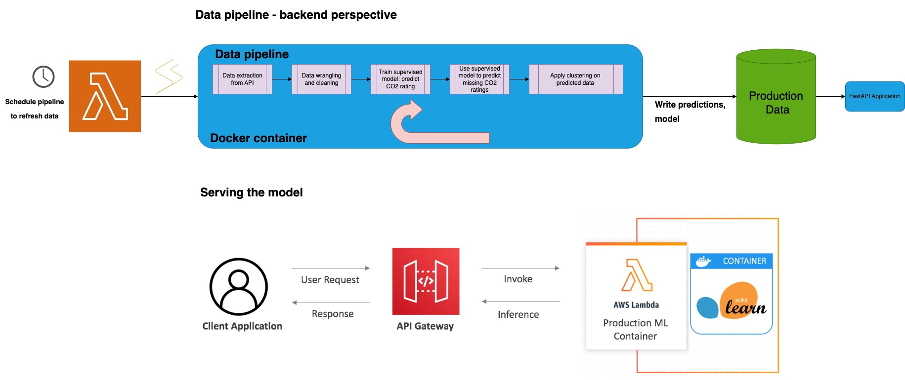

ml-vehicle-classification
==============================

Classifying data from hybrid, fuel only and electric vehicles

https://user-images.githubusercontent.com/13559004/236241577-81a83980-651c-46a0-b11f-273bcfa24569.mov

[Medium post about how the natural language API works is built](https://medium.com/@lgutierrwr/leveraging-fastapi-openai-and-sqlalchemy-for-natural-language-sql-queries-89052547289f)

# Architecture



# About the data

Data consists on vehicle model information for three kinds of vehicles: fuel-based, electric and hybrid vehicles. 

Data is extracted from an API listed on [this site](https://open.canada.ca/data/en/dataset/98f1a129-f628-4ce4-b24d-6f16bf24dd64). The data source operates under [Open Government License - Canada](http://open.canada.ca/en/open-government-licence-canada).

The vehicles in this dateset underwent [five cycle fuel consumption testing](https://natural-resources.canada.ca/energy-efficiency/transportation-alternative-fuels/fuel-consumption-guide/understanding-fuel-consumption-ratings/fuel-consumption-testing/21008):

* City test
* Highway test
* Cold temperature operation
* Air conditioner use
* Higher speeds with more rapid acceleration and braking

Vehicles are assigned a CO2 rating, a smog rating, and CO2 emissions are evaluated. 

I am interested to uncover patterns and interesting insights between fuel-based, electric and hybrid vehicles. 

The data pipeline consists of five scripts:

1. Data download and wrangling: extracts data on vehicle models from this [public API](https://open.canada.ca/data/api/action/package_show?id=98f1a129-f628-4ce4-b24d-6f16bf24dd64)
2. CO2 ratings are missing in a large proportion of fuel-based vehicles. The goal of this script is to perform supervised learning (voting classifier) to impute missing CO2 scores based on fuel-based vehicles. A model is setup and saved.
3. Model is used to complete missing values for CO2 ratings. Given there is a high correlation between CO2 ratings and smog ratings, KNNImputer is used on to complete missing smog rating scores.
4. Once the data is labelled, clustering is perfomed with the purpose of uncovering patterns. Recursive feature elimination with cross-validation is used to identify key features. Once key features are selected, Agglomerative Clustering, TSNE is computed for 2 and 3 dimensions, then results are compared against labelled data.
5. Results are served via an API with two key entry points:
* Search: a natural language entry point that can ask questions about the data.
* Predict: use the API to predict CO2 rating scores based on key features. 
6. [In progress] a dashboard with visualizations (includes interesting vehicle stats, clustering results in 3D)
7. [Future work] scrape vehicle purchases data and analyse consumer trends with a focus on changes in ratios of types of vehicles purchased over time

# Set up 

## Setting up, with Docker

Ensure you have Docker installed. Ensure you have an OpenAI API key. Create a `.env` file with the parameters

`OPENAI_API_KEY=<your-api-key>`

```
docker pull lgfunderburk/vehicle_classification:search
docker run -it --rm -p 8000:8000 -v /path/to/your/.env:/app/.env lgfunderburk/vehicle_classification:search
```

Then visit http://localhost:8000

## Setting up, locally

Clone the repo

```
git clone https://github.com/lfunderburk/fuel-electric-hybrid-vehicle-ml.git
cd fuel-electric-hybrid-vehicle-ml
```

Create and activate a virtual environment

```
conda create --name mlenv python==3.10
conda activate mlenv
```

Install dependencies

```
pip install -r requrements.txt
```

## Executing the data pipeline - locally

From command line at the project root directory level

```
ploomber build
```

This command will execute the following data pipeline

```
tasks:
  - source: src/data/data_extraction.py
    product:
      nb: notebooks/data_extraction.ipynb
  - source: src/models/train_model.py
    product:
      nb: notebooks/train_model.ipynb
      model: models/hard_voting_classifier_co2_fuel.pkl
  - source: src/models/predict_model.py
    product:
      nb: notebooks/predict_model.ipynb
  - source: src/models/clustering.py
    product:
      nb: notebooks/clustering.ipynb
```

Sample output

```
name             Ran?      Elapsed (s)    Percentage
---------------  ------  -------------  ------------
data_extraction  True          29.371        8.13723
train_model      True         136.637       37.8553
predict_model    True          52.2234      14.4685
clustering       True         142.715       39.5391
```

## Running tests

From command line at the project root directory level

```
pytest
```

## Run API

From command line at the project root directory level

```
uvicorn src.app.app:app

```

## Deployment methods:

1. This application consists of a Dash app with a dashboard that allows the user to visualize trends in different kinds of vehicles and consumer trends with a time component. 

2. The data pipeline is scheduled to refresh and retrain the model in batches, and saves the model's results to a database/api for easier retrieval. 


<p><small>Project based on the <a target="_blank" href="https://drivendata.github.io/cookiecutter-data-science/">cookiecutter data science project template</a>. #cookiecutterdatascience</small></p>
